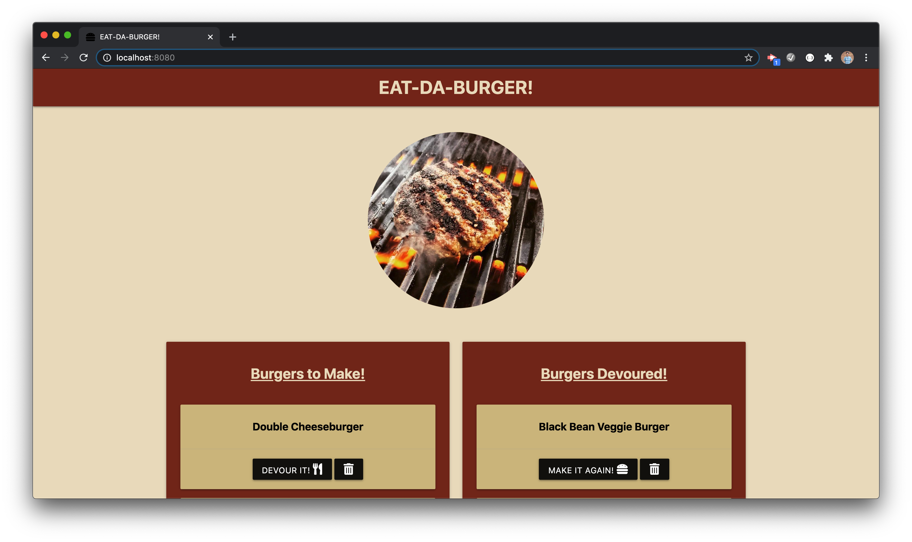
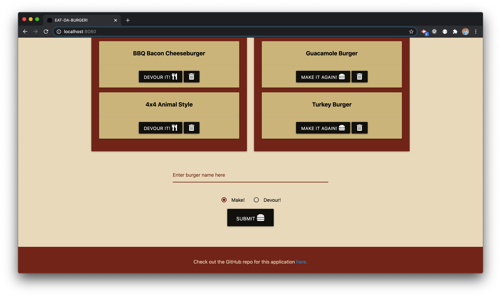

# Eat-Da-Burger!

## Description
<!-- This repository holds the homework assignment for Week 13 of the [The Coding Boot Camp](https://techbootcamps.utexas.edu/coding/) through the University of Texas at Austin's Center for Professional Education. -->

This application is a burger logger that incorporates the use of a lot of new technologies. This application adds on to the use of Node and Express by using MySQL for database support and Handlebars to render the UI.

This application follows two new styles of coding:
- MVC: Model-View-Controller
    - MVC is found in file structure but also in the process that this full-stack application takes from front-end to back-end and back to front-end.
- CRUD: Create, Read, Update, Delete
    - CRUD includes all the flexibility that this application gives the user. The user is able to __create__ a new burger that they would like to eat, __read__ the burgers stored in the database by seeing them in the column based on their status, __update__ the status of burger to devoured or make again, and __delete__ a burger from the database.

## Notes
This application uses the following Node.js packages:
- [mysql](https://www.npmjs.com/package/mysql)
- [express](http://expressjs.com/)
- [express-handlebars](https://www.npmjs.com/package/express-handlebars)

This application also takes into consideration separation of concerns within the program. This application uses a ORM (Object Relational Mapper) file to define the SQL queries, a controller file that defines the routes and all the logic that is included in those routes, and a model that manages the data and logic of the application.

## Instructions
This project is deployed on Heroku [here](https://rr-eat-da-burger.herokuapp.com/).

<!-- To use this project you will need to clone this [repository](https://github.com/ryanrotman/homework-13-eat-da-burger) and then open it in your text editor of choice. You will also need access to a CLI. This projected was created using VSCode and then run in the integrated terminal. Assuming that Node.js is already installed, you will need to run ```npm install``` and then you can run ```node server.js``` to launch the application and proceed through the prompts. -->

## Page Screenshots



## Contributing
Any and all collaboration is welcome so if you have any suggestions or thoughts for new features, please send me an email at ryan.rotman@gmail.com.